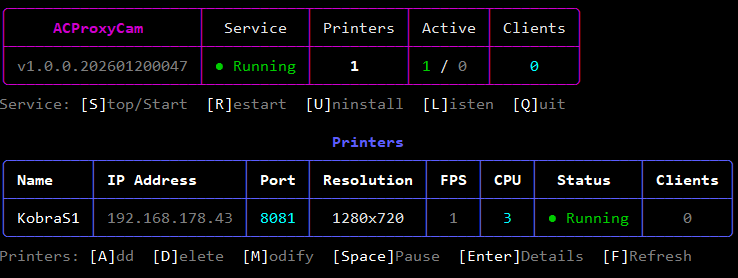

# ACProxyCam

Anycubic Camera Proxy for Linux - Converts FLV camera streams from Anycubic 3D printers to MJPEG for Mainsail/Fluidd/Moonraker compatibility.



## Features

- Multi-printer support with individual MJPEG streams on separate ports
- Auto-detection of printer model code and device ID via MQTT
- Auto-retrieval of MQTT credentials from printer via SSH
- **Stream recovery** - intercepts external stop commands (from slicers) and instantly restarts camera, with automatic SSH+LAN mode retry when MQTT fails
- **Configurable FPS** - MaxFps for streaming, IdleFps for snapshots when no clients connected
- **CPU affinity** - distributes printer threads across CPU cores for better performance
- **Camera LED control** - toggle camera LED via HTTP API or management interface, with optional auto-control
- Systemd service with watchdog support
- Interactive terminal management interface using Spectre.Console with auto-refresh
- Pre-flight connectivity check when adding printers
- Encrypted credential storage (AES-256-GCM with machine-specific key)
- Automatic retry with intelligent backoff (5s if responsive, 30s if offline)
- Log rotation via logrotate
- **HomeAssistant integration** - REST API compatible with HomeAssistant switches

## Requirements

- Linux x64 or arm64 (Raspberry Pi 4+, etc.)
- **FFmpeg 6.x or 7.x** with development libraries
- Anycubic printer with camera (Kobra S1, etc.)

### FFmpeg Installation

The application requires FFmpeg runtime libraries (not just the binary). Install the appropriate packages for your distribution:

**Debian/Ubuntu/Raspberry Pi OS:**
```bash
sudo apt install ffmpeg libavcodec-dev libavformat-dev libavutil-dev libswscale-dev
```

**Fedora/RHEL:**
```bash
sudo dnf install ffmpeg ffmpeg-devel
```

**Arch Linux:**
```bash
sudo pacman -S ffmpeg
```

> **Note:** The app requires FFmpeg 6.x or newer. Older distributions with FFmpeg 4.x are not supported.

## Quick Start

```bash
# Download the latest release for your architecture
wget https://github.com/yourusername/acproxycam/releases/latest/download/acproxycam-linux-x64
chmod +x acproxycam-linux-x64

# Run with sudo for installation
sudo ./acproxycam-linux-x64
```

The interactive installer will:
1. Check and optionally install FFmpeg
2. Let you select listening network interfaces
3. Create the `acproxycam` system user
4. Install and start the systemd service
5. Configure log rotation

## Usage

### Management Interface

Run `sudo acproxycam` to enter the interactive management interface.

**Service Controls:**
| Key | Action |
|-----|--------|
| `S` | Stop/Start service |
| `R` | Restart service |
| `U` | Uninstall service |
| `L` | Change listening interfaces |

**Printer Controls:**
| Key | Action |
|-----|--------|
| `A` | Add printer |
| `D` | Delete printer |
| `M` | Modify printer settings |
| `Space` | Pause/Resume printer |
| `T` | Toggle camera LED |
| `Enter` | View printer details |
| `Q` | Quit |

### Adding a Printer

Press `A` and provide:
- **Printer name** - Unique identifier for this printer
- **Printer IP address** - IP address of the printer on your network
- **MJPEG listening port** - Port for the MJPEG stream (default: 8080)
- **SSH port** - SSH port on printer (default: 22)
- **SSH credentials** - Username/password (default: root/rockchip)
- **MQTT port** - MQTT broker port on printer (default: 9883)

### Accessing Streams

Once a printer is configured and running, access the streams at:

| Endpoint | URL | Description |
|----------|-----|-------------|
| MJPEG Stream | `http://server-ip:8080/stream` | Live video stream |
| Snapshot | `http://server-ip:8080/snapshot` | Current frame as JPEG |
| Status | `http://server-ip:8080/status` | JSON status info |
| LED Status | `http://server-ip:8080/led` | GET: JSON `{"state":"on\|off","brightness":0-100}` |
| LED On | `http://server-ip:8080/led/on` | POST: Turn LED on |
| LED Off | `http://server-ip:8080/led/off` | POST: Turn LED off |

Configure the stream URLs in Mainsail/Fluidd webcam settings.

### Multiple Printers

Each printer requires a unique MJPEG port. Example setup:
- Printer 1: port 8080
- Printer 2: port 8081
- Printer 3: port 8082

## Building from Source

```bash
# Clone the repository
git clone https://github.com/yourusername/acproxycam.git
cd acproxycam

# Build for Linux x64
dotnet publish src/ACProxyCam/ACProxyCam.csproj -c Release -r linux-x64 --self-contained true -p:PublishSingleFile=true

# Build for Linux arm64 (Raspberry Pi 4+)
dotnet publish src/ACProxyCam/ACProxyCam.csproj -c Release -r linux-arm64 --self-contained true -p:PublishSingleFile=true

# Output will be in:
# src/ACProxyCam/bin/Release/net8.0/linux-x64/publish/acproxycam
# src/ACProxyCam/bin/Release/net8.0/linux-arm64/publish/acproxycam
```

## Configuration

Configuration is stored at `/etc/acproxycam/config.json`. Sensitive fields (passwords) are encrypted using AES-256-GCM with a key derived from `/etc/machine-id`.

Example configuration:
```json
{
  "listenInterfaces": ["0.0.0.0"],
  "printers": [
    {
      "name": "MyPrinter",
      "ip": "192.168.1.100",
      "mjpegPort": 8080,
      "sshPort": 22,
      "sshUser": "root",
      "mqttPort": 9883
    }
  ]
}
```

## HomeAssistant Integration

You can integrate the camera LED control with HomeAssistant as a switch.

### REST Switch Configuration

Add this to your `configuration.yaml`:

```yaml
rest_command:
  printer_led_on:
    url: http://192.168.1.10:8080/led/on
    method: POST
  printer_led_off:
    url: http://192.168.1.10:8080/led/off
    method: POST

switch:
  - platform: template
    switches:
      printer_camera_led:
        friendly_name: "Printer Camera LED"
        turn_on:
          service: rest_command.printer_led_on
        turn_off:
          service: rest_command.printer_led_off
```

Replace `192.168.1.10:8080` with your ACProxyCam server IP and port.

After adding the configuration:
1. Go to **Developer Tools > YAML > Check Configuration**
2. Click **Restart** to apply the changes
3. Find `switch.printer_camera_led` in **Settings > Devices & Services > Entities**

You can then add this switch to any dashboard.

## Systemd Service

The service is managed by systemd:

```bash
# Check status
sudo systemctl status acproxycam

# Start/stop/restart
sudo systemctl start acproxycam
sudo systemctl stop acproxycam
sudo systemctl restart acproxycam

# Enable/disable on boot
sudo systemctl enable acproxycam
sudo systemctl disable acproxycam
```

## Logs

- **Journal:** `journalctl -u acproxycam -f`
- **File:** `/var/log/acproxycam/acproxycam.log`

Log rotation is configured to keep 7 days of compressed logs.

## Troubleshooting

### Cannot connect to printer
1. Verify the printer IP is correct and reachable: `ping <printer-ip>`
2. Check SSH access: `ssh root@<printer-ip>` (default password: rockchip)
3. Verify MQTT port is accessible: `nc -zv <printer-ip> 9883`

### Stream not working
1. Check printer details in management UI (press Enter on printer)
2. Verify all status indicators are green (SSH, MQTT, Stream)
3. Check the FLV stream directly: `curl http://<printer-ip>:18088/flv`

### Service won't start
1. Check logs: `journalctl -u acproxycam -e`
2. Verify FFmpeg is installed: `ffmpeg -version`
3. Check permissions on `/etc/acproxycam` and `/var/log/acproxycam`

## Technical Details

### Architecture
- **.NET 8.0** single-file self-contained executable
- **FFmpeg** via system libraries for H.264 decoding
- **SkiaSharp** for JPEG encoding
- **MQTTnet** for printer camera control
- **SSH.NET** for credential retrieval
- **Spectre.Console** for terminal UI

### Protocol Flow
1. Connect to printer via SSH, retrieve MQTT credentials from `/userdata/app/gk/config/device_account.json`
2. Connect to MQTT broker on printer (port 9883, TLS)
3. Subscribe to all topics, auto-detect model code
4. Send "startCapture" command to enable camera stream
5. Connect to FLV stream at `http://<printer>:18088/flv`
6. Decode H.264 frames using FFmpeg, convert to JPEG using SkiaSharp
7. Serve MJPEG stream on configured port

## License

MIT License

## Acknowledgments

Based on protocol analysis of Anycubic Slicer Next communication with Kobra S1 printers.
