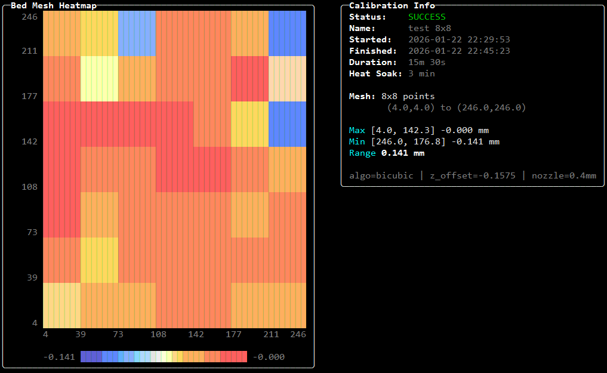
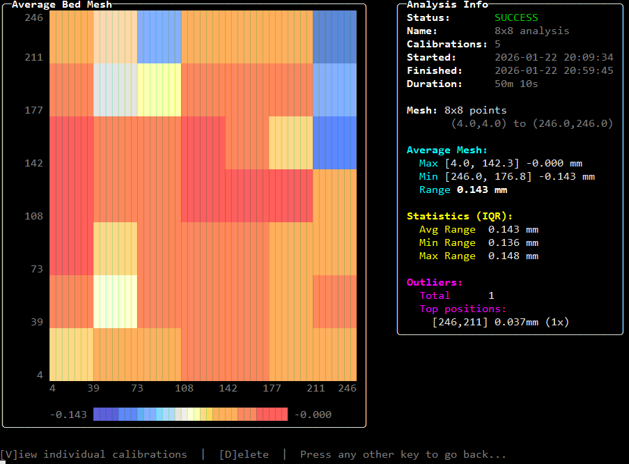

# ACProxyCam

Anycubic Camera Proxy for Linux - Stream your Anycubic 3D printer camera to Mainsail, Fluidd, Home Assistant, Obico & more.


## Features

- **Multi-format streaming** - MJPEG, H.264 WebSocket (jmuxer), HLS, and Low-Latency HLS (~1s delay)
- **Obico integration** - AI failure detection with simultaneous local server and Obico Cloud support
- **Multi-printer support** - Individual streams on separate ports with per-printer configuration
- **Streamer controls** - Enable/disable individual endpoints (H.264, HLS, LL-HLS, MJPEG) to minimize CPU
- **Smart camera control** - AutoLanMode keeps camera accessible, auto-recovery from slicer stop commands
- **LED management** - Toggle via HTTP API or CLI, auto-control with configurable standby timeout
- **BedMesh tools** - Calibration with heat soak, analysis with 3D visualization and outlier detection
- **Home Assistant ready** - REST API for snapshots, status, and LED control
- **Encrypted config** - AES-256-GCM with machine-specific key derivation
- **Docker support** - Multi-arch image with web terminal (ttyd) and Janus WebRTC gateway

## Requirements

- Linux x64 or arm64 (Raspberry Pi 4+, etc.)
- **FFmpeg 6.x or 7.x** with development libraries
- Anycubic printer with camera (Kobra S1, etc.)

### FFmpeg Installation

**Debian/Ubuntu/Raspberry Pi OS:**
```bash
sudo apt install ffmpeg libavcodec-dev libavformat-dev libavutil-dev libswscale-dev
```

**Fedora/RHEL:**
```bash
sudo dnf install ffmpeg ffmpeg-devel
```

**Arch Linux:**
```bash
sudo pacman -S ffmpeg
```

> **Note:** FFmpeg 6.x or newer required. Older distributions with FFmpeg 4.x are not supported.

## Quick Start

### Native Installation

```bash
# Download the latest release for your architecture
wget https://github.com/mann1x/acproxycam/releases/latest/download/acproxycam-linux-arm64-v1.4.0.zip
unzip acproxycam-linux-arm64-v1.4.0.zip
chmod +x acproxycam

# Run with sudo for installation
sudo ./acproxycam
```

The interactive installer will:
1. Check and optionally install FFmpeg
2. Let you select listening network interfaces
3. Create the `acproxycam` system user
4. Install and start the systemd service
5. Configure log rotation

### Docker Installation

```bash
docker run -d \
  --name acproxycam \
  --restart unless-stopped \
  --network host \
  -v acproxycam-config:/etc/acproxycam \
  -v /etc/machine-id:/etc/machine-id:ro \
  ghcr.io/mann1x/acproxycam:latest
```

**Alternative:** Also available on Docker Hub as `mannixita/acproxycam`

See [docker/README.md](docker/README.md) for complete Docker documentation including web terminal setup and Janus WebRTC configuration.

## Usage

### Management Interface

Run `sudo acproxycam` to enter the interactive management interface.

**Main Menu:**
| Key | Action |
|-----|--------|
| `A` | Add printer |
| `D` | Delete printer |
| `M` | Modify printer settings |
| `Space` | Pause/Resume printer |
| `T` | Toggle camera LED |
| `Enter` | View printer details |
| `B` | BedMesh calibration menu |
| `O` | Obico integration menu |
| `Q` | Quit |

**Service Controls (native only, hidden in Docker):**
| Key | Action |
|-----|--------|
| `S` | Stop/Start service |
| `R` | Restart service |
| `U` | Uninstall service |
| `L` | Change listening interfaces |

### Adding a Printer

Press `A` and provide:
- **Printer name** - Unique identifier for this printer
- **Printer IP address** - IP address of the printer on your network
- **HTTP port** - Port for all streaming endpoints (default: 8080)
- **SSH credentials** - Username/password (default: root/rockchip)
- **Streaming options** - Enable/disable H.264, HLS, LL-HLS, MJPEG endpoints

### Streamer Configuration

Each streaming endpoint can be individually enabled or disabled:

| Streamer | Default | Description |
|----------|---------|-------------|
| H.264 WebSocket | Enabled | Low-latency stream for jmuxer (Mainsail/Fluidd) |
| HLS | Enabled | HTTP Live Streaming for browsers |
| LL-HLS | Enabled | Low-Latency HLS (~1s delay) |
| MJPEG | Disabled | Higher CPU usage, legacy compatibility |

HTTP endpoints (snapshot, status, LED control) are always available regardless of streamer settings.

### AutoLanMode

AutoLanMode ensures the printer's camera remains accessible by automatically enabling LAN mode when needed. This prevents issues where the camera becomes unavailable after being accessed by the Anycubic slicer or cloud services.

Configure per-printer in the Modify menu.

### LED Auto-Control

When enabled, the camera LED automatically:
- Turns on when streaming clients connect
- Turns off after a configurable standby timeout (default: 20 minutes) when no clients are connected

Configure per-printer in the Modify menu.

### FPS Display

The dashboard shows real-time FPS measured from actual H.264 packets received from the printer. This may differ significantly from the FPS advertised in the stream metadata.

**Example:** The Kobra S1 stream metadata declares 10fps, but the printer actually delivers ~4fps. ACProxyCam measures and displays the true incoming frame rate, helping you understand actual camera performance.

> **Note:** The "declared" FPS in printer details shows the metadata value. The dashboard FPS column shows real-time measured rate.

### Accessing Streams

Once a printer is configured and running:

| Endpoint | URL | Description |
|----------|-----|-------------|
| Snapshot | `http://server:8080/snapshot` | Current frame as JPEG |
| Status | `http://server:8080/status` | JSON status info |
| H.264 WebSocket | `ws://server:8080/h264` | H.264 stream for jmuxer |
| HLS (LL-HLS) | `http://server:8080/hls/playlist.m3u8` | Low-Latency HLS (~1-2s) |
| HLS (Legacy) | `http://server:8080/hls/legacy.m3u8` | Standard HLS for older players |
| MJPEG Stream | `http://server:8080/stream` | Live MJPEG (if enabled) |
| LED Status | `http://server:8080/led` | GET: `{"state":"on|off","brightness":0-100}` |
| LED On/Off | `http://server:8080/led/on` | POST: Toggle LED |

### Mainsail/Fluidd Configuration

**H.264 Stream (Recommended - Lower CPU):**

Add to `moonraker.conf`:

```ini
[webcam Webcam]
enabled: True
service: jmuxer-stream
target_fps: 15
target_fps_idle: 5
stream_url: ws://<acproxycam-ip>:8080/h264
snapshot_url: http://<acproxycam-ip>:8080/snapshot
rotation: 0
```

**MJPEG Stream (Legacy):**

Configure in Mainsail/Fluidd UI:
- Stream URL: `http://<acproxycam-ip>:8080/stream`
- Snapshot URL: `http://<acproxycam-ip>:8080/snapshot`

## Obico Integration

ACProxyCam includes full Obico integration for AI-powered print failure detection. You can connect to both a local Obico server and Obico Cloud simultaneously.

### Obico Menu

Press `O` in the management interface:

| Key | Action |
|-----|--------|
| `1` | Configure local Obico server |
| `2` | Configure Obico Cloud |
| `3` | View Obico status dashboard |
| `Esc` | Return to main menu |

### Features

- **AI Failure Detection** - Obico's AI monitors your prints for spaghetti and other failures
- **Dual Connection** - Connect to both self-hosted Obico server and Obico Cloud simultaneously
- **Native H.264 Streaming** - WebRTC via Janus gateway for efficient video delivery
- **Print Status Sync** - Real-time progress, layer info, temperatures reported to Obico
- **Firmware Sync** - Print cancellation from Obico properly notifies Anycubic firmware

### Setup

1. **Link Printer**: In the Obico menu, select your connection type (local or cloud)
2. **Authenticate**: Three options available:
   - **Direct login** - Enter your Obico email/password to automatically link the printer (works with both local and cloud)
   - **Verification code** - Get a 6-digit code from Obico web UI to link the printer
   - **Direct token** - Enter auth token manually for advanced setups
3. **Configure Janus**: For WebRTC streaming, configure Janus gateway URL (required for video)

### Janus WebRTC Gateway

For H.264 streaming to Obico, a Janus WebRTC gateway is required:

- **Docker**: Janus is included and auto-configured
- **Native**: Install Janus separately and configure the WebSocket URL in Obico settings

## BedMesh Calibration & Analysis

Press `B` in the management interface:

| Key | Action |
|-----|--------|
| `1` | Run single calibration |
| `2` | Run analysis (multiple calibrations) |
| `3` | View saved calibrations |
| `4` | View saved analyses |
| `Esc` | Return to main menu |

### Single Calibration



1. Select a printer
2. Enter heat soak time (0 to skip)
3. Optionally name the calibration
4. View color-coded heatmap with statistics

### Analysis (Multiple Calibrations)



Run multiple calibrations to detect probing inconsistencies:

- **IQR-based outlier detection** - Identifies probe points with inconsistent readings
- **Statistical analysis** - Average mesh, standard deviation, range across runs
- **Minimum threshold** - 0.030mm based on strain gauge probe accuracy

## HomeAssistant Integration

### Camera Integration

**MJPEG IP Camera (Recommended):**

1. Go to **Settings > Devices & Services > Add Integration**
2. Search for "MJPEG IP Camera"
3. Configure:
   - MJPEG URL: `http://<acproxycam-ip>:8080/stream`
   - Still image URL: `http://<acproxycam-ip>:8080/snapshot`

**WebRTC Camera (HACS - For HLS):**

Install [WebRTC Camera](https://github.com/AlexxIT/WebRTC) from HACS and add a card:

```yaml
type: custom:webrtc-camera
url: http://<acproxycam-ip>:8080/hls/playlist.m3u8
```

### LED Switch Configuration

Add to `configuration.yaml`:

```yaml
sensor:
  - platform: rest
    name: kobra_s1_camera_led_state
    resource: http://<acproxycam-ip>:8080/led
    scan_interval: 5
    value_template: "{{ value_json.state }}"
    verify_ssl: false

rest_command:
  kobra_s1_led_on:
    url: http://<acproxycam-ip>:8080/led/on
    method: POST
  kobra_s1_led_off:
    url: http://<acproxycam-ip>:8080/led/off
    method: POST

switch:
  - platform: template
    switches:
      kobra_s1_camera_led:
        friendly_name: "Kobra S1 Camera LED"
        value_template: "{{ states('sensor.kobra_s1_camera_led_state') == 'on' }}"
        turn_on:
          service: rest_command.kobra_s1_led_on
        turn_off:
          service: rest_command.kobra_s1_led_off
```

## Multiple Printers

Each printer requires a unique HTTP port:
- Printer 1: port 8080
- Printer 2: port 8081
- Printer 3: port 8082

## Configuration

Configuration is stored at `/etc/acproxycam/config.json`. Sensitive fields are encrypted using AES-256-GCM with a key derived from `/etc/machine-id`.

## Systemd Service

```bash
sudo systemctl status acproxycam    # Check status
sudo systemctl restart acproxycam   # Restart
sudo systemctl stop acproxycam      # Stop
journalctl -u acproxycam -f         # View logs
```

Log file: `/var/log/acproxycam/acproxycam.log` (7 days rotation)

## Building from Source

```bash
git clone https://github.com/mann1x/acproxycam.git
cd acproxycam

# Build for Linux x64
dotnet publish src/ACProxyCam/ACProxyCam.csproj -c Release -r linux-x64 --self-contained true -p:PublishSingleFile=true

# Build for Linux arm64
dotnet publish src/ACProxyCam/ACProxyCam.csproj -c Release -r linux-arm64 --self-contained true -p:PublishSingleFile=true
```

## Troubleshooting

### Cannot connect to printer
1. Verify printer IP: `ping <printer-ip>`
2. Check SSH: `ssh root@<printer-ip>` (password: rockchip)
3. Check MQTT port: `nc -zv <printer-ip> 9883`

### Stream not working
1. Check printer details (press Enter on printer)
2. Verify status indicators are green
3. Test FLV stream: `curl http://<printer-ip>:18088/flv`

### Service won't start
1. Check logs: `journalctl -u acproxycam -e`
2. Verify FFmpeg: `ffmpeg -version`
3. Check permissions on `/etc/acproxycam`

## Technical Details

### Architecture
- **.NET 8.0** single-file self-contained executable
- **FFmpeg** via system libraries for H.264 decoding
- **SkiaSharp** for JPEG encoding
- **MQTTnet** for printer camera control
- **SSH.NET** for credential retrieval
- **Spectre.Console** for terminal UI

### Protocol Flow
1. SSH to printer, retrieve MQTT credentials
2. Connect to MQTT broker (port 9883, TLS)
3. Subscribe to topics, auto-detect model code
4. Send "startCapture" to enable camera
5. Connect to FLV stream at `http://<printer>:18088/flv`
6. Decode H.264, encode to JPEG/HLS/WebSocket
7. Serve streams on configured port

## License

MIT License

## Acknowledgments

Based on protocol analysis of Anycubic Slicer Next communication with Kobra S1 printer.
